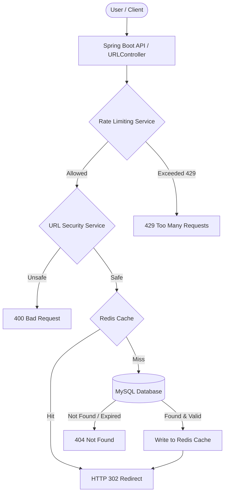

# URL Shortener

A high-performance, lightweight URL shortener service built with Spring Boot, Spring Data JPA, MySQL, and Redis. It converts long web links into compact Base62 short codes while enforcing URL security validation, request rate limiting, and expiration policies. The application includes click analytics tracking and a clean responsive web interface for easy URL management.

## Live Demo

Access the live application deployed on Render:  
[https://url-shortner-1-6t79.onrender.com](https://url-shortner-1-6t79.onrender.com)

## Features

• **URL Shortening**: Accepts long URLs and generates compact short links.  
• **Base62 Short Code Generation**: Encodes unique auto-increment database IDs into base-62 strings (`0-9`, `a-z`, `A-Z`).  
• **Custom Short Codes**: Allows users to specify custom aliases with format validation and reserved path protection.  
• **URL Expiration**: Supports configurable lifetime options (`1h`, `1d`, `7d`, `30d`, `never`).  
• **Redis Caching**: Caches original URLs in memory to serve redirection requests with low latency.  
• **Click Analytics**: Tracks and increments total click counts in Redis for each short code.  
• **Rate Limiting**: Limits requests per IP address using Redis to prevent service abuse.  
• **URL Security Validation**: Blocks invalid protocols, `localhost`, direct IP addresses, local/private network ranges, and suspicious URL patterns or keywords.  
• **Duplicate URL Handling**: Reuses existing short codes when an identical original URL is submitted without a custom code.  
• **REST API**: Provides HTTP REST endpoints for URL creation, redirection, and analytics retrieval.  
• **Responsive Frontend**: Includes a built-in single-page interface (`index.html`) using clean HTML, CSS, and JavaScript.

## System Architecture

The service processes client requests through a layered pipeline that checks rate limits and security rules before accessing data stores.

### Request Flow



### Redis Cache Hit and Cache Miss Flow

1. **Cache Hit**:
   - The user navigates to `/{shortCode}`.
   - Spring Boot checks Redis for key `shortCode`.
   - Redis returns the target URL instantly.
   - Click count for `clicks:{shortCode}` is incremented in Redis.
   - The application returns an HTTP `302 Found` redirect.

2. **Cache Miss**:
   - Spring Boot checks Redis for key `shortCode`, but the key does not exist.
   - The application queries the MySQL database (`urls` table) by short code.
   - If found and not expired:
     - Click count for `clicks:{shortCode}` is incremented in Redis.
     - The target URL is written to Redis with a TTL matching the remaining URL expiration time (capped at 10 minutes for non-expiring URLs).
     - The application returns an HTTP `302 Found` redirect.
   - If not found or expired:
     - Returns HTTP `404 Not Found`.

## How It Works

1. **Creating a Short URL**: The client posts a JSON payload to `/shorten` containing the original URL, optional custom code, and selected expiration time.
2. **Generating the Base62 Short Code**: For auto-generated links, a temporary record is saved to MySQL to obtain an auto-increment ID (`Long id`), which is then converted into a Base62 string (`0-9`, `a-z`, `A-Z`) using the formula `number % 62`.
3. **Saving the URL in MySQL**: The mapping between `short_code`, `original_url`, and `expires_at` is persisted in the MySQL database.
4. **Redis Caching**: Active short code lookups are cached in Redis for up to 10 minutes to reduce database read load.
5. **Redirecting Users**: When accessing `/{shortCode}`, the controller retrieves the original link and issues an HTTP `302 Found` response with the `Location` header.
6. **Click Tracking**: Each redirect invocation increments an in-memory counter stored under the Redis key `clicks:{shortCode}`.
7. **URL Expiration**: Expired links are detected by comparing `expires_at` with `LocalDateTime.now()`. Expired links return HTTP `404`.
8. **Rate Limiting**: `RateLimitService` tracks request counts per client IP using key `rate_limit:{ipAddress}` in Redis over a 1-minute sliding window.
9. **URL Security Validation**: `URLSecurityService` parses incoming URIs, verifying scheme, host resolution, IP safety, and domain security before short link creation.

## API Endpoints

### 1. Serve Frontend
| Method | Endpoint | Purpose |
| :--- | :--- | :--- |
| `GET` | `/` | Serves the web UI (`index.html`) |

---

### 2. Create Short URL
| Method | Endpoint | Purpose |
| :--- | :--- | :--- |
| `POST` | `/shorten` | Creates a new short URL or returns an existing short code |

**Request Example**:
```json
POST /shorten
Content-Type: application/json

{
  "url": "https://example.com/very-long-web-address",
  "customCode": "my-custom-link",
  "expiration": "7d"
}
```

**Response Example (200 OK)**:
```text
https://url-shortner-1-6t79.onrender.com/my-custom-link
```

**Error Responses**:
- `400 Bad Request`: `"URL is not allowed"`, `"Custom code must contain only letters, numbers, _ or -"`, `"This custom code is reserved"`, or `"Invalid expiration time"`
- `409 Conflict`: `"Custom short URL already exists"`
- `429 Too Many Requests`: `"Too many requests. Try again later."`

---

### 3. Redirect Short URL
| Method | Endpoint | Purpose |
| :--- | :--- | :--- |
| `GET` | `/{shortCode}` | Redirects user to the original URL |

**Request Example**:
```text
GET /my-custom-link
```

**Response Example (302 Found)**:
```text
Status: 302 Found
Location: https://example.com/very-long-web-address
```

---

### 4. Click Analytics
| Method | Endpoint | Purpose |
| :--- | :--- | :--- |
| `GET` | `/analytics/{shortCode}` | Retrieves total click count for a short link |

**Request Example**:
```text
GET /analytics/my-custom-link
```

**Response Example (200 OK)**:
```text
Short code: my-custom-link
Clicks: 15
```

## Project Structure

```text
url_short/
├── Dockerfile
├── pom.xml
├── mvnw
├── mvnw.cmd
└── src/
    ├── main/
    │   ├── java/
    │   │   └── com/
    │   │       └── example/
    │   │           └── url_short/
    │   │               ├── UrlShortApplication.java
    │   │               ├── URLController.java
    │   │               ├── URLShortener.java
    │   │               ├── URLSecurityService.java
    │   │               ├── RateLimitService.java
    │   │               ├── URL.java
    │   │               └── URLRepository.java
    │   └── resources/
    │       ├── application.properties
    │       └── static/
    │           ├── index.html
    │           ├── style.css
    │           └── script.js
    └── test/
```

### Class Responsibilities

| Class | Responsibility |
| :--- | :--- |
| `UrlShortApplication.java` | Spring Boot application entry point and main method. |
| `URLController.java` | REST Controller handling routing (`/`, `/shorten`, `/{shortCode}`, `/analytics/{shortCode}`), rate limit checks, and input validation. |
| `URLShortener.java` | Core domain service implementing Base62 encoding, database persistence, Redis cache access, expiration logic, and click tracking. |
| `URLSecurityService.java` | Security validation service ensuring submitted URLs use allowed protocols, avoid local/private IP ranges, and pass anti-phishing filters. |
| `RateLimitService.java` | Intercepts client IP addresses and enforces request limits using Redis counter keys. |
| `URL.java` | JPA entity representing the `urls` table structure in MySQL. |
| `URLRepository.java` | Spring Data JPA interface executing SQL queries for `short_code` and `original_url`. |

## Database

The application uses **MySQL** to store permanent short code mappings.

### Table Schema (`urls`)

```sql
CREATE TABLE urls (
    id BIGINT AUTO_INCREMENT PRIMARY KEY,
    short_code VARCHAR(255) UNIQUE,
    original_url VARCHAR(255) NOT NULL,
    expires_at DATETIME
);
```

### Entity Mapping (`URL.java`)

| Field | Column Name | Type | Constraints | Description |
| :--- | :--- | :--- | :--- | :--- |
| `id` | `id` | `Long` | Primary Key, `AUTO_INCREMENT` | Unique database identifier used for Base62 encoding |
| `shortCode` | `short_code` | `String` | `UNIQUE` | Unique short code alias |
| `originalUrl` | `original_url` | `String` | `NOT NULL` | The target long URL destination |
| `expiresAt` | `expires_at` | `LocalDateTime` | Nullable | Expiration timestamp for link validity |

## Redis

Redis (or Aiven Valkey) is used as an in-memory data store for performance optimization and rate control.

• **URL Caching**: Stores mappings between short codes and original URLs under key `{shortCode}`.  
• **Cache Hit**: Immediately retrieves cached URL on redirection without querying MySQL.  
• **Cache Miss**: Queries MySQL on missing key, verifies validity, and populates Redis cache.  
• **Click Count**: Increments key `clicks:{shortCode}` atomically on every link access.  
• **Rate Limiting**: Stores request count per IP in `rate_limit:{ipAddress}` with a 60-second expiration.  
• **Cache Expiration**: Non-expiring URLs are cached for 10 minutes (600 seconds). Expiring URLs are cached for either the remaining time until expiration or 10 minutes, whichever is smaller.

> Note: Redis acts strictly as a cache and rate limiter; MySQL remains the primary database.

## Security

`URLSecurityService` performs multi-layer checks before accepting any URL:

• **HTTP and HTTPS Validation**: Accepts only URLs starting with `http://` or `https://`.  
• **Localhost Blocking**: Rejects hosts named `localhost`.  
• **IP Address Blocking**: Blocks URLs referencing raw IPv4 (`x.x.x.x`) or IPv6 addresses.  
• **Private / Local Network Blocking**: Resolves target hostnames using `InetAddress` and blocks loopback, link-local, site-local, or wildcard local addresses.  
• **Suspicious Pattern Checks**:
  - Rejects URLs containing suspicious keywords (`phishing`, `malware`, `ransomware`, `keylogger`, `credential-steal`, `account-verify`, `verify-account`, `login-verify`, `secure-login`, etc.).
  - Blocks null byte and newline injections (`%00`, `%0d`, `%0a`).
  - Rejects hostnames with more than 5 domain levels (excessive dots).
  - Rejects hostnames containing `@` characters.

## Rate Limiting

The application implements IP-based rate limiting via `RateLimitService`:

• **Limit**: 10 requests per minute  
• **Time Window**: 1 minute (60 seconds)  
• **Redis Key**: `rate_limit:<ip_address>`  
• **Behavior**: If a client IP exceeds 10 requests within 60 seconds, the server returns status `429 Too Many Requests`.

## URL Expiration

The system supports 5 expiration configurations:

| Option Value | Duration | Expiration Time |
| :--- | :--- | :--- |
| `1h` | 1 hour | Current time + 1 hour |
| `1d` | 1 day | Current time + 1 day |
| `7d` | 7 days | Current time + 7 days |
| `30d` | 30 days | Current time + 30 days |
| `never` | Unlimited | `null` (never expires) |

*If an unrecognized option is passed, it defaults to `7d`.*

## Running Locally

Follow these steps to run the project locally on Windows:

### 1. Clone Repository
```powershell
git clone https://github.com/Yudaya3006/URL-Shortner.git
cd URL-Shortner/url_short
```

### 2. Configure MySQL
Ensure MySQL Server is running locally on port `3306` and create the database:
```sql
CREATE DATABASE url_shortener;
```

### 3. Configure Redis
Start a local Redis instance on port `6379`.

### 4. Configure Environment Variables
Set temporary environment variables in PowerShell:
```powershell
$env:DB_URL="jdbc:mysql://localhost:3306/url_shortener"
$env:DB_USERNAME="root"
$env:DB_PASSWORD="your_mysql_password"
$env:REDIS_HOST="localhost"
$env:REDIS_PORT="6379"
$env:PORT="10000"
```

### 5. Start the Spring Boot Application
Run using the Maven wrapper:
```powershell
.\mvnw.cmd clean spring-boot:run
```

### 6. Open the Frontend
Open your browser and navigate to:
```text
http://localhost:10000
```

## Environment Variables

The application configures database and cache connections using environment variables in `application.properties`:

| Variable | Description | Example / Default |
| :--- | :--- | :--- |
| `DB_URL` | MySQL JDBC connection string | `jdbc:mysql://localhost:3306/url_shortener` |
| `DB_USERNAME` | Database username | `root` |
| `DB_PASSWORD` | Database password | `your_db_password` |
| `REDIS_HOST` | Redis server hostname | `localhost` |
| `REDIS_PORT` | Redis server port | `6379` |
| `REDIS_USERNAME` | Redis username (if applicable) | `default` |
| `REDIS_PASSWORD` | Redis password (if applicable) | `your_redis_password` |
| `REDIS_SSL` | Enable SSL for Redis (`true`/`false`) | `false` |
| `PORT` | Application HTTP server port | `10000` |

## Docker

The project includes a multi-stage Docker build configuration (`Dockerfile`):

```dockerfile
FROM eclipse-temurin:25-jdk

WORKDIR /app

COPY . .

RUN chmod +x mvnw
RUN ./mvnw clean package -DskipTests

CMD ["sh", "-c", "java -jar target/*.jar --server.port=${PORT:-10000}"]
```

### Build and Run with Docker

1. **Build Docker Image**:
   ```bash
   docker build -t url-shortener .
   ```

2. **Run Container**:
   ```bash
   docker run -p 10000:10000 \
     -e DB_URL="jdbc:mysql://host.docker.internal:3306/url_shortener" \
     -e DB_USERNAME="root" \
     -e DB_PASSWORD="your_password" \
     -e REDIS_HOST="host.docker.internal" \
     -e REDIS_PORT="6379" \
     url-shortener
   ```

## Deployment

The application is deployed using cloud infrastructure:

```text
GitHub Repository
   ↓
Render (Spring Boot Docker Container)
   ↓
Aiven Cloud Services (Aiven MySQL & Aiven Valkey Redis)
```

• **Render**: Hosts and runs the Spring Boot Docker container, exposing the HTTP interface on port `10000`.  
• **Aiven MySQL**: Managed MySQL database storing persistent URL records.  
• **Aiven Valkey**: Fully managed Redis-compatible service handling link caching and rate limiting with SSL enabled.

## Screenshots

*(Screenshots of the application interface can be added here)*

```text
+-------------------------------------------------------+
|                 URL Shortener UI                      |
|                                                       |
|  [ Enter long URL...                             ]    |
|  [ Custom Code (Optional) ] [ Expiration: 7d v ]      |
|  [ Shorten URL Button ]                               |
|                                                       |
|  Result: https://url-shortner-1-6t79.onrender.com/xyz |
+-------------------------------------------------------+
```

## Future Improvements

• **User Authentication**: User registration and JWT-based authentication for managing personal links.  
• **Custom Domains**: Support for custom brand domain names.  
• **Advanced Analytics**: Detailed breakdown of user geolocation, browser, device, and referral traffic.  
• **QR Code Generation**: Automatic QR code creation for generated short links.  
• **Distributed Rate Limiting Improvements**: Redis Lua scripts implementing token bucket or sliding window algorithms.  
• **Monitoring & Observability**: Integration with Prometheus and Grafana for metrics tracking.  
• **Admin Dashboard**: Administrative panel to view metrics, ban malicious domains, and clear stale cache items.

## Learning / System Design Concepts

This project demonstrates core backend system design principles:

• **Caching**: Reducing database query latency by serving hot records from in-memory cache.  
• **Database Persistence**: Managing relational entity lifecycles using JPA/Hibernate and MySQL.  
• **Base62 Encoding**: Converting 64-bit numerical database identifiers into short alphanumeric strings.  
• **Rate Limiting**: Defending endpoints against brute force attacks and resource exhaustion.  
• **URL Expiration**: Managing data retention lifecycles and cache TTL synchronization.  
• **REST APIs**: Designing intuitive HTTP contracts adhering to standard verbs and status codes.  
• **Docker Containerization**: Packaging application dependencies for reproducible environments.  
• **Cloud Deployment**: Integrating managed SaaS infrastructure (Render, Aiven) in production.  
• **Cache Hit / Cache Miss**: Implementing cache-aside patterns to optimize system throughput.  
• **Separation of Concerns**: Decoupling controllers, services, repositories, and security layers.

## Author

**Ch. Yudayamadhavi**
